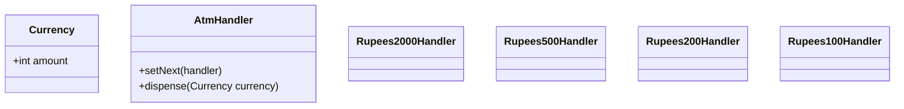

# ATM Dispenser - Design Document

## 1. Requirements
- **Goal**: Dispense a specific amount of cash using available denominations (2000, 500, 200, 100).
- **Logic**:
    - Always try to use the largest denomination first.
    - Pass the *remaining* amount to the next handler.
    - If the amount cannot be fully dispensed (e.g., not a multiple of 100), throw an error.

## 2. Architecture
- **Chain**: `Rupees2000` -> `Rupees500` -> `Rupees200` -> `Rupees100`.
- **Pattern Variation**: **Quantitative Decomposition**. Unlike previous examples where *one* handler handles the *whole* request, here *multiple* handlers contribute to the solution.

## 3. Class Design

