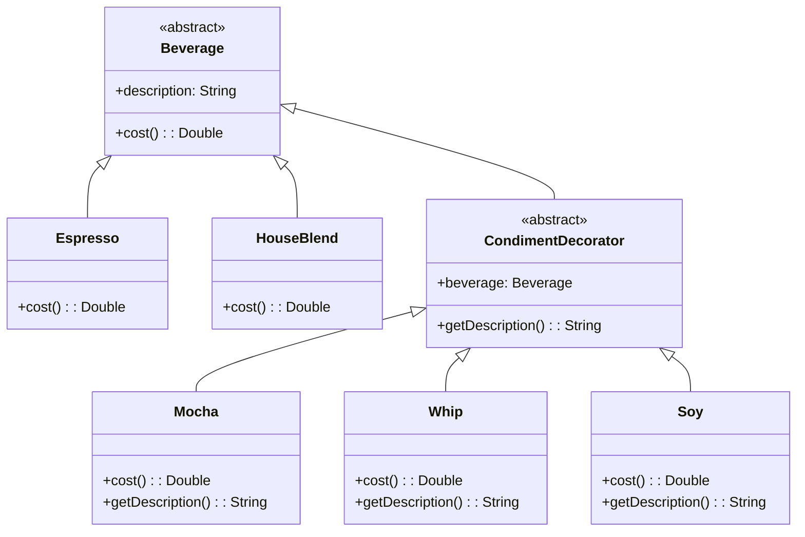

# Decorator Pattern Example 1 - Coffee Shop

## 1. Requirements
- **Goal**: Dynamically add condiments to beverages and calculate the total cost and description.
- **Beverages**:
    - `Espresso`: $1.99, "Espresso"
    - `HouseBlend`: $0.89, "House Blend Coffee"
- **Condiments (Decorators)**:
    - `Mocha`: +$0.20, ", Mocha"
    - `Whip`: +$0.10, ", Whip"
    - `Soy`: +$0.15, ", Soy"

## 2. Architecture
- **Pattern**: **Decorator**.
- **Key Idea**: Decorators wrap the component they decorate. They have the same supertype as the object they decorate.

## 3. Class Design

