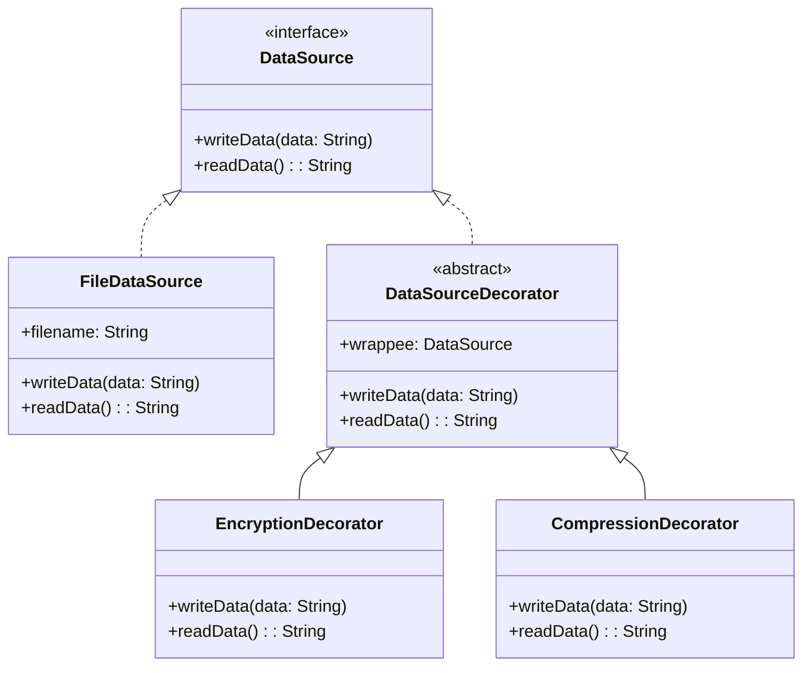

# Decorator Pattern Example 2 - Data Source (Encryption & Compression)

## 1. Requirements
- **Goal**: Add encryption and compression behavior to data reading and writing operations transparently.
- **Component**: `DataSource` (reads and writes string data).
- **Concrete Component**: `FileDataSource` (writes to and reads from a file).
- **Decorators**:
    - `EncryptionDecorator`: Encrypts data before writing, decrypts after reading.
    - `CompressionDecorator`: Compresses data before writing, decompresses after reading.

## 2. Architecture
- **Pattern**: **Decorator**.
- **Key Idea**: Decorators intercept the `writeData` and `readData` calls to transform the data.

## 3. Class Design

