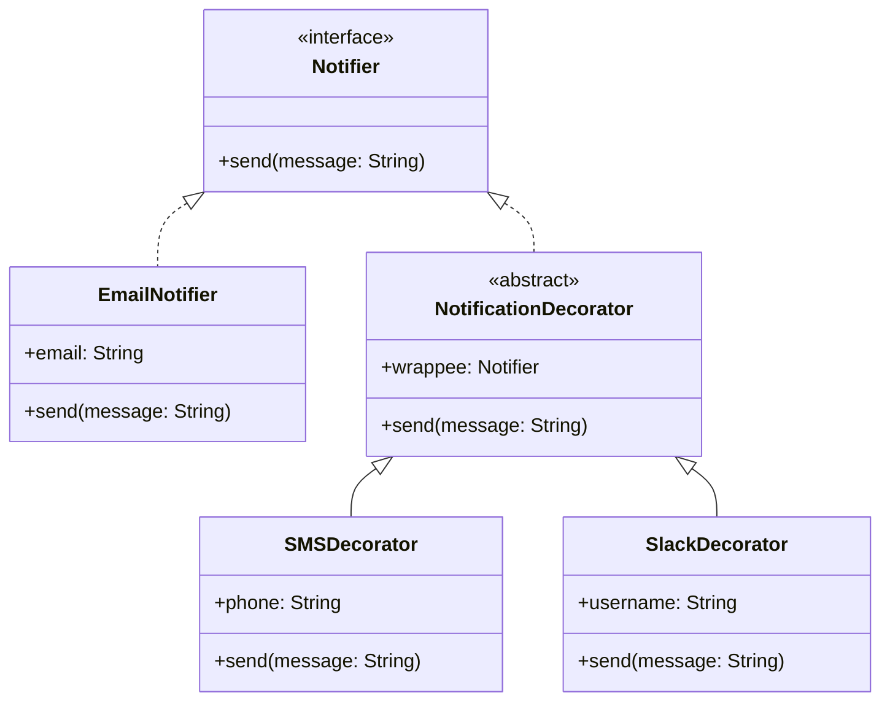

# Decorator Pattern Example 3 - Notification System

## 1. Requirements
- **Goal**: Send notifications via multiple channels (Email, SMS, Slack) by stacking decorators.
- **Component**: `Notifier` (sends a message).
- **Concrete Component**: `EmailNotifier` (Base implementation, sends email).
- **Decorators**:
    - `SMSDecorator`: Sends SMS in addition to the wrapped notifier's action.
    - `SlackDecorator`: Sends Slack message in addition to the wrapped notifier's action.

## 2. Architecture
- **Pattern**: **Decorator**.
- **Key Idea**: Each decorator performs its own action (sending a message) and then calls the wrapped notifier. This results in a chain of notifications.

## 3. Class Design

