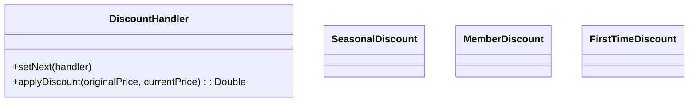

# Discount Calculator - Design Document

## 1. Requirements
- **Goal**: Apply multiple discounts to a final price.
- **Logic**:
    - **SeasonalDiscount**: 10% off.
    - **MemberDiscount**: 5% off.
    - **FirstTimeDiscount**: 20% off.
- **Pattern Variation**: **Cumulative Chain**. Unlike previous examples where one handler stops the chain, here *all* handlers might run to apply cumulative effects (or stop if a rule says "no more discounts").

## 2. Architecture
- **Chain**: `Seasonal` -> `Member` -> `FirstTime`.

## 3. Class Design

