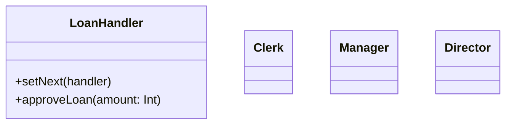

# Loan Approval - Design Document

## 1. Requirements
- **Goal**: Approve a loan amount based on the approver's limit.
- **Logic**:
    - **Clerk**: Can approve up to 10,000.
    - **Manager**: Can approve up to 50,000.
    - **Director**: Can approve anything above 50,000.
- **Pattern Variation**: **Threshold Escalation**. The request is passed up the chain until a handler has enough *authority* to handle it.

## 2. Architecture
- **Chain**: `Clerk` -> `Manager` -> `Director`.

## 3. Class Design

