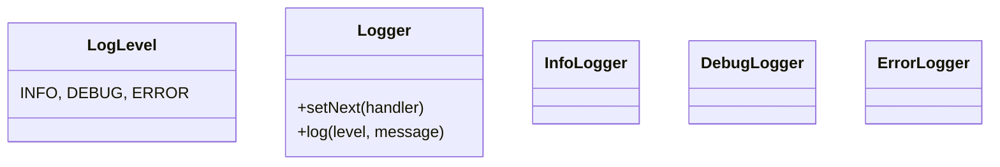

# Log Processor - Design Document

## 1. Requirements
- **Goal**: Process log messages based on their severity level.
- **Logic**:
    - **InfoLogger**: Handles INFO level.
    - **DebugLogger**: Handles DEBUG level.
    - **ErrorLogger**: Handles ERROR level.
- **Pattern Variation**: **Level Filtering**. A handler might process the request *and* pass it down (e.g., Error logs might need to be printed to console AND saved to file), or just handle it. For this example, we'll assume strict responsibility: if level matches, handle it.

## 2. Architecture
- **Chain**: `InfoLogger` -> `DebugLogger` -> `ErrorLogger`.

## 3. Class Design

