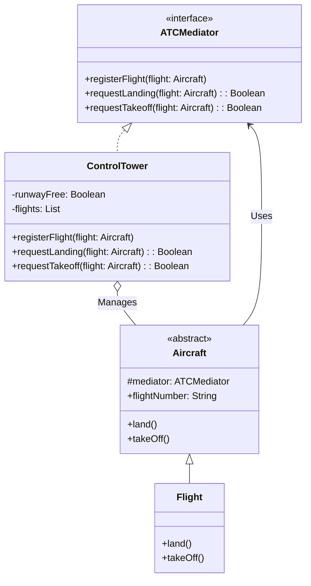

# Mediator Pattern Example 2 - Air Traffic Control

## 1. Requirements
- **Goal**: Coordinate landing and takeoff of flights to prevent collisions.
- **Mediator**: `ControlTower` (Manages runway status).
- **Colleague**: `Flight` (Requests permission).

## 2. Architecture
- **Pattern**: **Mediator**.
- **Key Idea**: Flights do not communicate with each other. They ask the `ControlTower` for permission. The tower keeps track of whether the runway is free.

## 3. Class Design

