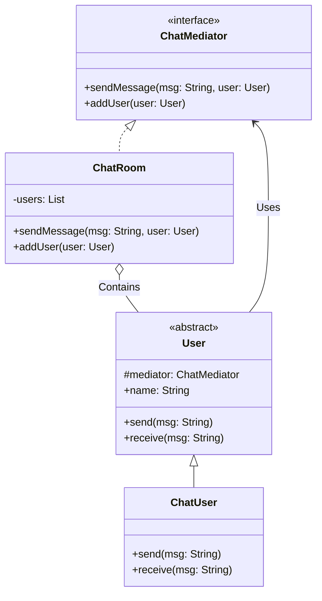

# Mediator Pattern Example 1 - Chat Room

## 1. Requirements
- **Goal**: Enable users to send messages to each other without having direct references to one another.
- **Mediator**: `ChatRoom` (Handles message broadcasting).
- **Colleague**: `ChatUser` (Sends/Receives messages).

## 2. Architecture
- **Pattern**: **Mediator**.
- **Key Idea**: Users send messages to the `ChatRoom`. The `ChatRoom` iterates through its list of registered users and calls their `receive` method (excluding the sender).

## 3. Class Design

