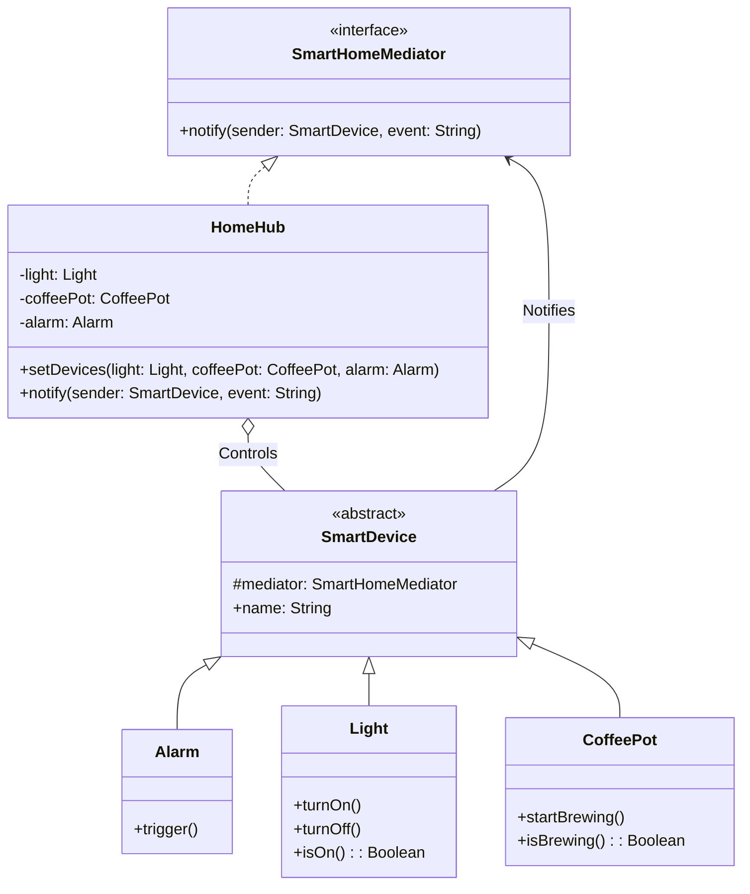

# Mediator Pattern Example 3 - Smart Home Hub

## 1. Requirements
- **Goal**: Automate interactions between smart devices based on events.
- **Mediator**: `HomeHub` (Central controller).
- **Colleagues**: `Alarm`, `Light`, `CoffeePot`.
- **Scenario**: When `Alarm` triggers, `HomeHub` should turn on `Light` and start `CoffeePot`.

## 2. Architecture
- **Pattern**: **Mediator**.
- **Key Idea**: Devices send events to the `HomeHub` via `notify()`. The Hub contains the business logic to decide what other devices should react to that event.

## 3. Class Design

