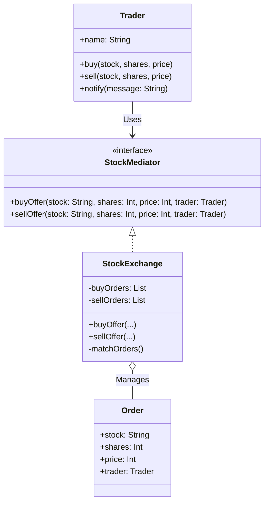

# Mediator Pattern Example 5 - Stock Exchange

## 1. Requirements
- **Goal**: Match Buy and Sell orders between traders.
- **Mediator**: `StockExchange` (Broker).
- **Colleague**: `Trader`.
- **Scenario**: Trader A wants to buy 100 shares of AAPL at $150. Trader B wants to sell 100 shares of AAPL at $150. The Exchange matches them and executes the trade.

## 2. Architecture
- **Pattern**: **Mediator**.
- **Key Idea**: Traders submit orders to the Exchange. The Exchange maintains a book of open orders. When a new order comes in, it checks if it can be matched with an existing order.

## 3. Class Design

