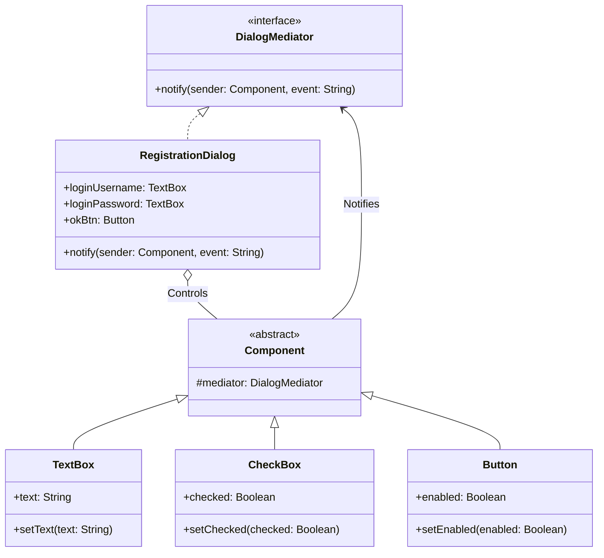

# Mediator Pattern Example 4 - UI Dialog Form

## 1. Requirements
- **Goal**: Manage the state of a "Submit" button based on the state of other components (TextBox, CheckBox).
- **Mediator**: `RegistrationDialog` (Central controller).
- **Colleagues**: `TextBox`, `CheckBox`, `Button`.
- **Scenario**: Button is enabled ONLY if TextBox is not empty AND CheckBox is checked.

## 2. Architecture
- **Pattern**: **Mediator**.
- **Key Idea**: Components notify the Mediator when their state changes. The Mediator checks the state of all relevant components and updates the Button accordingly.

## 3. Class Design

