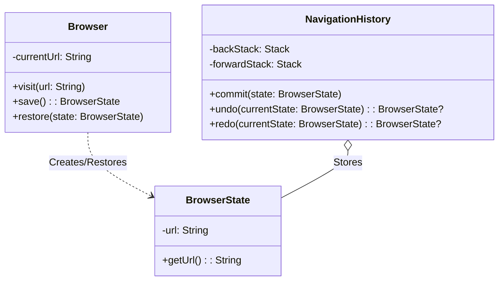

# Memento Pattern Example 4 - Browser Navigation (Back/Forward)

## 1. Requirements
- **Goal**: Implement browser-like navigation with Back and Forward capabilities.
- **Originator**: `Browser` (Holds current URL).
- **Memento**: `BrowserState` (Immutable snapshot).
- **Caretaker**: `NavigationHistory` (Manages Back and Forward stacks).

## 2. Architecture
- **Pattern**: **Memento**.
- **Key Idea**:
    - Visiting a new page pushes the *current* state to the **Back Stack** and clears the **Forward Stack**.
    - Clicking **Back** pushes the *current* state to the **Forward Stack** and restores the state popped from the **Back Stack**.
    - Clicking **Forward** pushes the *current* state to the **Back Stack** and restores the state popped from the **Forward Stack**.

## 3. Class Design

