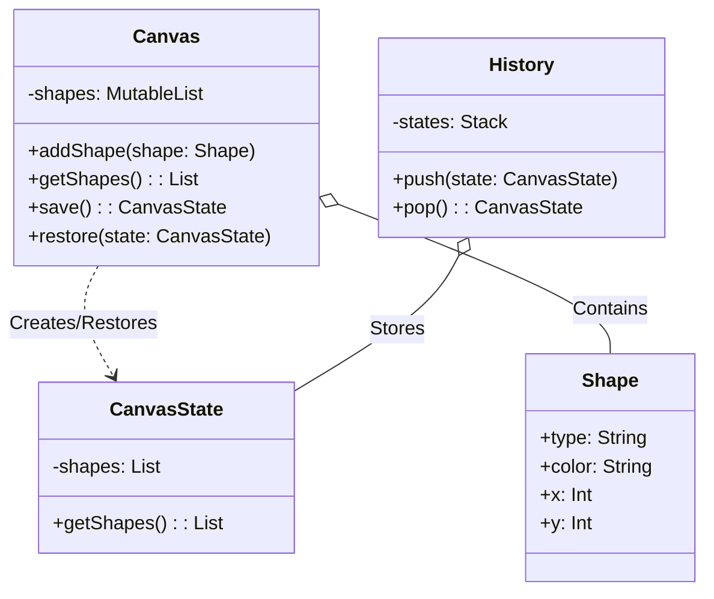

# Memento Pattern Example 3 - Drawing Canvas

## 1. Requirements
- **Goal**: Allow undoing the addition of shapes to a canvas.
- **Originator**: `Canvas` (Holds list of shapes).
- **Memento**: `CanvasState` (Immutable snapshot of the list).
- **Caretaker**: `History` (Stack of states).

## 2. Architecture
- **Pattern**: **Memento**.
- **Key Idea**: The `Canvas` holds a mutable list of shapes. When saving, it creates a `CanvasState` containing a *copy* of that list. This ensures that subsequent modifications to the canvas do not affect the saved state.

## 3. Class Design

