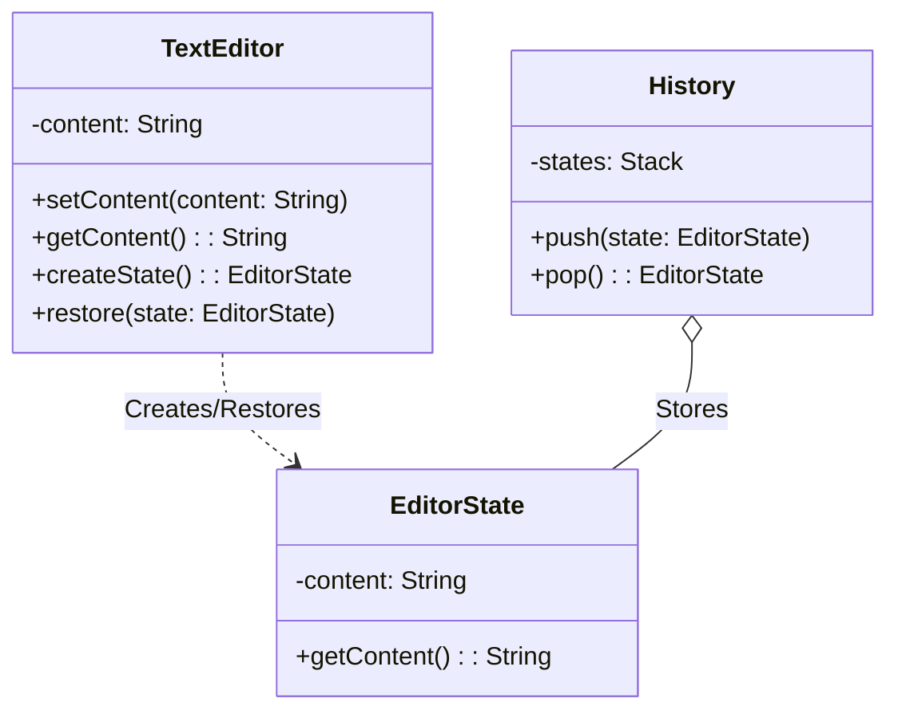

# Memento Pattern Example 1 - Text Editor (Undo/Redo)

## 1. Requirements
- **Goal**: Allow saving and restoring the state of a text editor (Undo mechanism).
- **Originator**: `TextEditor` (Holds content).
- **Memento**: `EditorState` (Immutable snapshot of content).
- **Caretaker**: `History` (Manages stack of states).

## 2. Architecture
- **Pattern**: **Memento**.
- **Key Idea**: The `TextEditor` creates a `EditorState` containing its current internal state. The `History` object stores this state. To undo, the `History` object passes the `EditorState` back to the `TextEditor`, which restores itself.

## 3. Class Design

