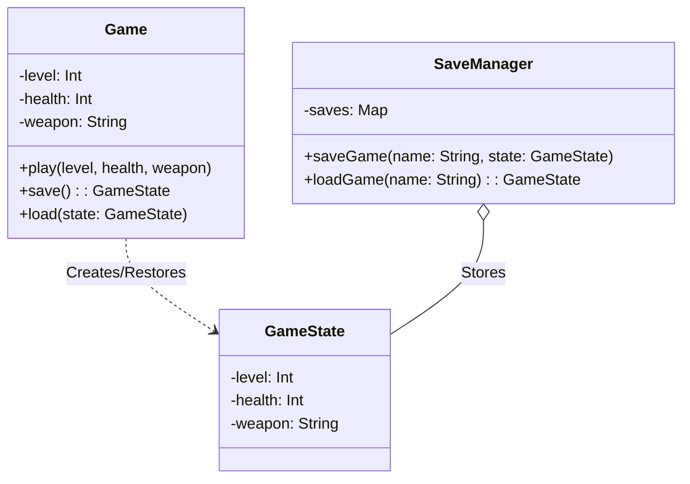

# Memento Pattern Example 2 - Game Save System

## 1. Requirements
- **Goal**: Save and load game progress (checkpoints).
- **Originator**: `Game` (Holds level, health, weapon).
- **Memento**: `GameState` (Immutable snapshot).
- **Caretaker**: `SaveManager` (Stores named saves).

## 2. Architecture
- **Pattern**: **Memento**.
- **Key Idea**: The `Game` creates a `GameState` snapshot. The `SaveManager` stores these snapshots in a Map, allowing retrieval by name (e.g., "Level 1", "Boss Fight").

## 3. Class Design

