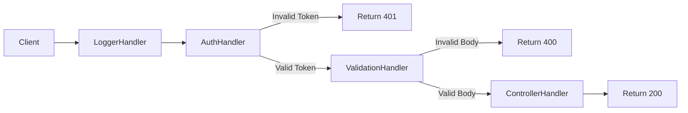
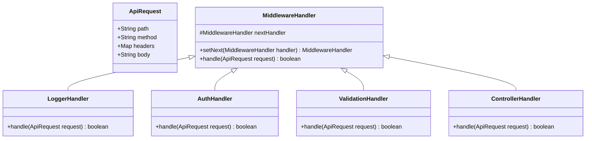

# API Request Middleware - Design Document

## 1. Requirements

### Functional Requirements
- **Pipeline Processing**: Requests must pass through a series of checks: **Logger → Authenticator → Validator → Controller**.
- **Short-Circuiting**:
    - If **Authenticator** fails (e.g., missing token), return `401 Unauthorized` immediately. The Controller is NOT reached.
    - If **Validator** fails (e.g., invalid body), return `400 Bad Request` immediately.
- **Success**: If all checks pass, the **Controller** processes the request and returns `200 OK`.

### Non-Functional Requirements
- **Pluggability**: Easy to add new middleware (e.g., RateLimiter) into the chain.
- **Order Independence**: The chain builder should allow flexible ordering (though logic usually dictates a specific order).

## 2. High-Level Architecture

### Handler Chain Structure (Pipeline)

## 3. Class Design

### Class Diagram

## 4. Sequence Flow

1.  **Client** sends `ApiRequest` (Header: "Auth: abc", Body: "data").
2.  **LoggerHandler**: Logs request. Calls `next`.
3.  **AuthHandler**: Checks "Auth" header.
    *   If missing: Print "401", return `false`. (Chain stops)
    *   If present: Calls `next`.
4.  **ValidationHandler**: Checks Body.
    *   If empty: Print "400", return `false`. (Chain stops)
    *   If valid: Calls `next`.
5.  **ControllerHandler**: Prints "200 OK", returns `true`.
