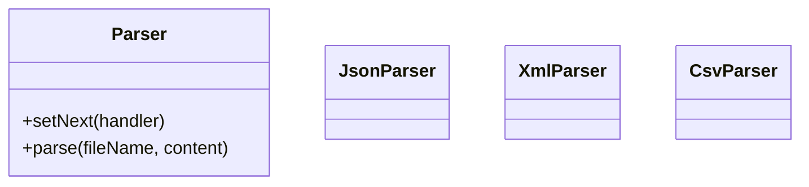

# File Parser - Design Document

## 1. Requirements
- **Goal**: Parse a file content based on its format.
- **Logic**:
    - **JsonParser**: Tries to parse as JSON.
    - **XmlParser**: Tries to parse as XML.
    - **CsvParser**: Tries to parse as CSV.
- **Pattern Variation**: **Trial-and-Error**. The request is passed down the chain until *one* handler successfully processes it. If a handler fails (throws exception or returns false), the next one tries.

## 2. Architecture
- **Chain**: `JsonParser` -> `XmlParser` -> `CsvParser`.

## 3. Class Design

