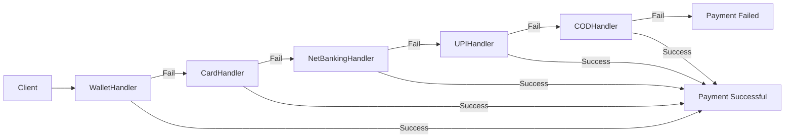
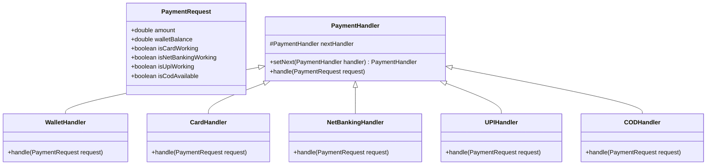

# Payment Processing Flow - Design Document

## 1. Requirements

### Functional Requirements
- The system must process payments using a sequence of methods: **Wallet → Card → Netbanking → UPI → COD**.
- If a method fails (e.g., insufficient funds, downtime), the request must automatically pass to the next method in the chain.
- If a method succeeds, the processing stops, and a success response is returned.
- If all methods fail, a failure response is returned.

### Non-Functional Requirements
- **Extensibility**: It should be easy to add new payment methods or reorder existing ones without modifying the core logic.
- **Loose Coupling**: The client (payment initiator) should not need to know which specific handler processes the request.
- **Simplicity**: The solution should be lightweight and easy to understand for an interview context.

## 2. Real-World Context: Payment Cascading
You raised a great point: users typically select their payment method. However, this **Chain of Responsibility** pattern is standard in **Backend Payment Gateways** for **"Smart Routing"** or **"Cascading"**.
- **Scenario**: A merchant wants to ensure a transaction succeeds.
- **Flow**: If the primary payment provider (e.g., Stripe) fails due to downtime, the system automatically routes the request to a backup provider (e.g., Adyen), then to another.
- **User Experience**: The user just clicks "Pay". The system tries multiple routes in the background to ensure success.
- **This Implementation**: Models this "fallback" logic where we try the most cost-effective/preferred method first (Wallet), then fallback to others.

## 3. High-Level Architecture

We will use the **Chain of Responsibility (CoR)** pattern.
- **Client**: Initiates the payment request.
- **Handler Interface (Abstract Class)**: Defines the contract for handling payments and setting the next handler.
- **Concrete Handlers**: Implement specific payment logic (Wallet, Card, etc.).

### Handler Chain Structure

## 3. Class Design

### Class Diagram

## 4. Sequence Flow

1.  **Client** creates a `PaymentRequest`.
2.  **Client** builds the chain: `wallet.setNext(card).setNext(netbanking)...`
3.  **Client** calls `wallet.handle(request)`.
4.  **WalletHandler** checks balance.
    *   If sufficient: Process payment, return success.
    *   If insufficient: Delegate to `nextHandler.handle(request)`.
5.  **CardHandler** checks availability.
    *   If available: Process, return success.
    *   If not: Delegate to next.
6.  ...Repeat until processed or end of chain.

## 5. Example Scenarios

### Scenario A: Wallet has sufficient funds
- **Input**: Amount: 100, Wallet: 500
- **Flow**: WalletHandler checks 500 >= 100 -> **Success**.
- **Output**: Paid via Wallet.

### Scenario B: Wallet empty, Card fails, Netbanking works
- **Input**: Amount: 100, Wallet: 0, Card Down, Netbanking Up.
- **Flow**:
    1.  WalletHandler (0 < 100) -> Pass.
    2.  CardHandler (Down) -> Pass.
    3.  NetBankingHandler (Up) -> **Success**.
- **Output**: Paid via NetBanking.

### Scenario C: All fail
- **Input**: Amount: 1000, Wallet: 0, All Banking Down, COD unavailable.
- **Flow**: Wallet -> Card -> Netbanking -> UPI -> COD -> **Fail**.
- **Output**: Payment Failed.
