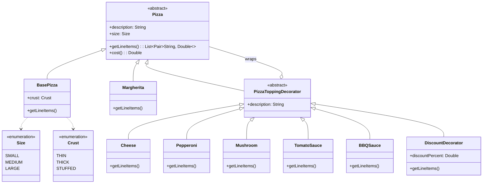
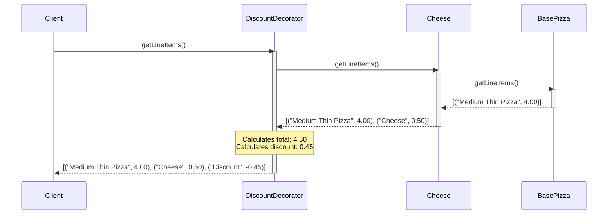

# Pizza Decorator Design

This document explains the design of the Pizza Decorator implementation, including the class structure and the execution flow for calculating costs and generating receipts.

## Class Diagram

The following class diagram illustrates the relationship between the `Pizza` component, concrete implementations, and decorators.

## Execution Flow

The Decorator pattern works by wrapping objects. When a method like `getLineItems()` or `cost()` is called, it triggers a chain of calls down to the base component and then bubbles back up, allowing each layer to add its own behavior or data.

### Sequence Diagram: `getLineItems()`

This diagram shows the flow when `getLineItems()` is called on a pizza wrapped with Cheese and a Discount.

**Scenario:** `Discount(Cheese(BasePizza))`

## Key Components

### 1. Component (`Pizza`)
The abstract base class that defines the common interface (`cost()`, `getLineItems()`, `description`, `size`).

### 2. Concrete Components (`BasePizza`, `Margherita`)
The base objects that can be decorated.
- **BasePizza**: Calculates cost based on `Size` and `Crust`.
- **Margherita**: A specific pizza type with fixed pricing per size.

### 3. Decorator (`PizzaToppingDecorator`)
The abstract wrapper that implements `Pizza` and holds a reference to a `Pizza` object. It delegates calls to the wrapped object.

### 4. Concrete Decorators
- **Toppings**: `Cheese`, `Pepperoni`, `Mushroom`. They add their own line item to the list returned by the wrapped pizza.
- **Sauces**: `TomatoSauce`, `BBQSauce`. Similar to toppings.
- **DiscountDecorator**: A special decorator that modifies the total cost. It calculates the discount based on the sum of all previous items and adds a negative line item.
