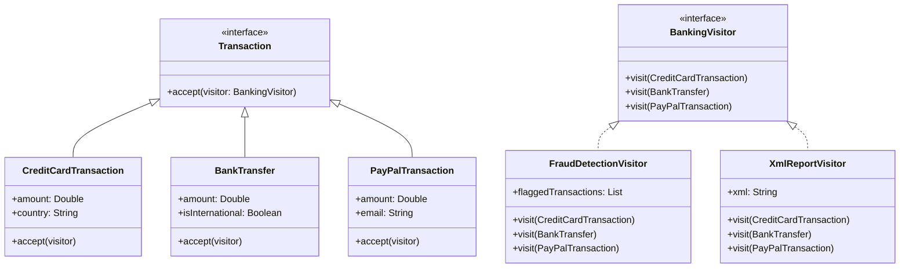

# Visitor Pattern Example 6 - Banking System (Fraud Detection)

## 1. Requirements
- **Goal**: Apply different operations (Fraud Detection, Reporting) to a stream of heterogeneous financial transactions.
- **Transactions**:
    - `CreditCardTransaction`: Amount, Country.
    - `BankTransfer`: Amount, International (Boolean).
    - `PayPalTransaction`: Amount, Email.
- **Operations**:
    - `FraudDetectionVisitor`:
        - CreditCard: Flag if > 5000 OR Country != "US".
        - BankTransfer: Flag if > 10000 OR International.
        - PayPal: Flag if email domain is "@suspicious.com".
    - `XmlReportVisitor`: Generates an XML representation of all transactions.

## 2. Architecture
- **Pattern**: **Visitor**.
- **Key Idea**: Encapsulate the complex, type-specific business logic (fraud rules) in the Visitor, keeping the Transaction classes simple data holders (DTOs).

## 3. Class Design

