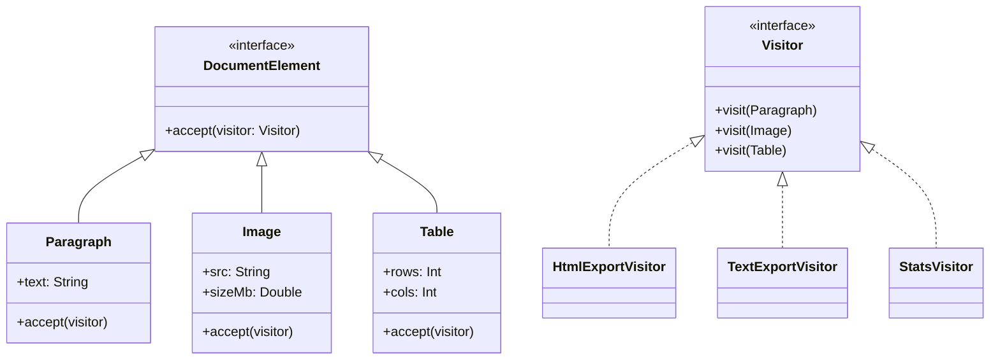

# Visitor Pattern Example - Document Processing

## 1. Requirements
- **Goal**: Perform different operations (Export to HTML, Export to Text, Calculate Stats) on a document structure without modifying the document elements themselves.
- **Elements**:
    - `Paragraph`: Contains text.
    - `Image`: Contains source URL and size.
    - `Table`: Contains row and column counts.
- **Operations**:
    - `HtmlExportVisitor`: Renders elements as HTML tags.
    - `TextExportVisitor`: Extracts plain text content.
    - `StatsVisitor`: Counts words, images, and total table cells.

## 2. Architecture
- **Pattern**: **Visitor**.
- **Key Idea**: Double Dispatch. The element calls `visitor.visit(this)`, passing itself to the visitor. The visitor then executes the logic specific to that element type.

## 3. Class Design

