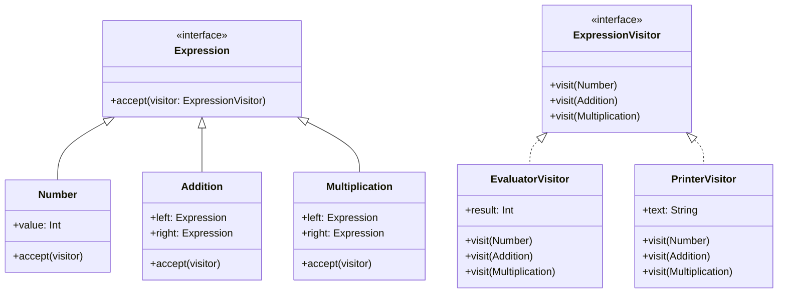

# Visitor Pattern Example 4 - Expression Evaluation

## 1. Requirements
- **Goal**: Evaluate and print mathematical expressions represented as a tree structure.
- **Structure**:
    - `Number`: A leaf node containing an integer value.
    - `Addition`: A composite node with left and right operands.
    - `Multiplication`: A composite node with left and right operands.
- **Operations**:
    - `EvaluatorVisitor`: Computes the integer result of the expression.
    - `PrinterVisitor`: Generates a string representation of the expression, respecting precedence (parentheses).

## 2. Architecture
- **Pattern**: **Visitor** on an **Abstract Syntax Tree (AST)**.
- **Key Idea**: The Visitor traverses the AST. `EvaluatorVisitor` reduces the tree to a single value. `PrinterVisitor` reconstructs the expression string.

## 3. Class Design

