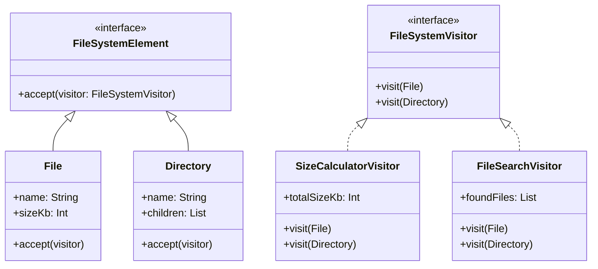

# Visitor Pattern Example 3 - File System

## 1. Requirements
- **Goal**: Perform operations (Calculate Size, Search Files) on a hierarchical file system structure.
- **Structure**:
    - `File`: Has a name and size.
    - `Directory`: Has a name and a list of children (Files or Directories).
- **Operations**:
    - `SizeCalculatorVisitor`: Calculates the total size of a directory (recursive sum).
    - `FileSearchVisitor`: Finds all files matching a name pattern (recursive search).

## 2. Architecture
- **Pattern**: **Visitor** combined with **Composite**.
- **Key Idea**: The Visitor traverses the tree structure. When visiting a `Directory`, the visitor (or the directory itself) iterates over children to continue the traversal.

## 3. Class Design

