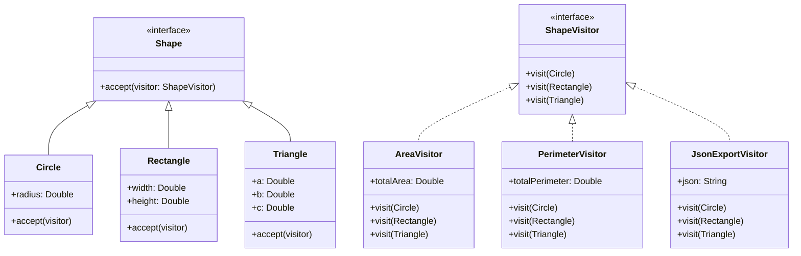

# Visitor Pattern Example 5 - Shape Geometry

## 1. Requirements
- **Goal**: Perform geometric calculations and serialization on different shapes.
- **Shapes**:
    - `Circle`: Radius.
    - `Rectangle`: Width, Height.
    - `Triangle`: Sides a, b, c.
- **Operations**:
    - `AreaVisitor`: Calculates area (using standard formulas).
    - `PerimeterVisitor`: Calculates perimeter.
    - `JsonExportVisitor`: Exports shape properties to JSON format.

## 2. Architecture
- **Pattern**: **Visitor**.
- **Key Idea**: Decouple the operations (Area, Perimeter, JSON) from the Shape classes.

## 3. Class Design

