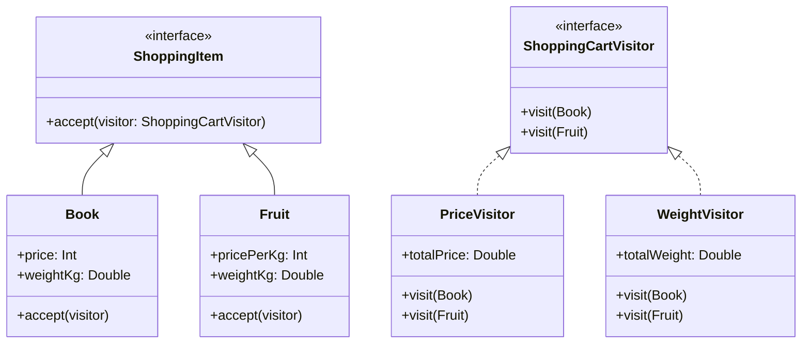

# Visitor Pattern Example 2 - Shopping Cart

## 1. Requirements
- **Goal**: Calculate different metrics (Total Price, Total Weight) for a shopping cart containing heterogeneous items.
- **Items**:
    - `Book`: Has a fixed price and weight.
    - `Fruit`: Has a price per kg and weight.
- **Operations**:
    - `PriceVisitor`: Calculates the total cost.
        - Book: `price`
        - Fruit: `pricePerKg * weightKg`
    - `WeightVisitor`: Calculates the total weight.

## 2. Architecture
- **Pattern**: **Visitor**.
- **Key Idea**: Iterate through a list of `ShoppingItem`s and call `accept(visitor)` on each. The visitor accumulates the result.

## 3. Class Design

